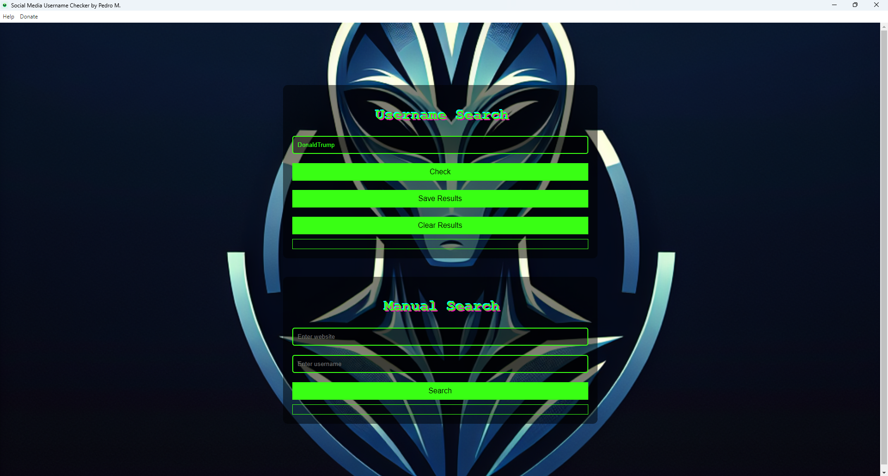

# SocialMediaChecker

SocialMediaChecker is a Node.js application designed to help users search for usernames across 100+ websites. It provides results indicating whether a username is taken or available and offers direct links to view specific profiles.

How to Download and Install

Step 1: Clone the Repository

Clone the Repository:
Click on the green Code button.
Copy the repository URL (https://github.com/devx0x0/SocialMediaChecker.git)

Open Terminal or Command Prompt:
Open your terminal (Linux/Mac) or command prompt (Windows).

Clone the Repository Locally:
Run the following command to clone the repository to your local machine:
git clone https://github.com/devx0x0/SocialMediaChecker.git

Step 2: Navigate to the Project Directory
Change Directory:
Navigate to the cloned repository directory:
cd SocialMediaChecker

Step 3: Install Node.js and npm
Install Node.js and npm:
Ensure you have Node.js and npm installed. You can download them from nodejs.org.

Step 4: Install Project Dependencies
Install Dependencies:
Run the following command to install all necessary dependencies:
npm install
This command will install all the required node_modules specified in the package.json file.

Step 5: Run the Application
Start the Application:
Run the following command to start the application:
npm start

Summary
Clone the repository from GitHub.

Navigate to the project directory.

Install Node.js and npm if not already installed.

Install dependencies using npm install.

Run the application using npm start.

By following these steps, you can successfully download, install, and set up the SocialMediaChecker application on your local machine.

Additional Information
Dependencies: This project uses various Node.js packages listed in the package.json file. Make sure to review this file for any specific package requirements.
Contributing: If you wish to contribute to this project, please fork the repository, create a new branch, make your changes, and submit a pull request.
Issues: If you encounter any issues or have any questions, please open an issue on the GitHub repository.
